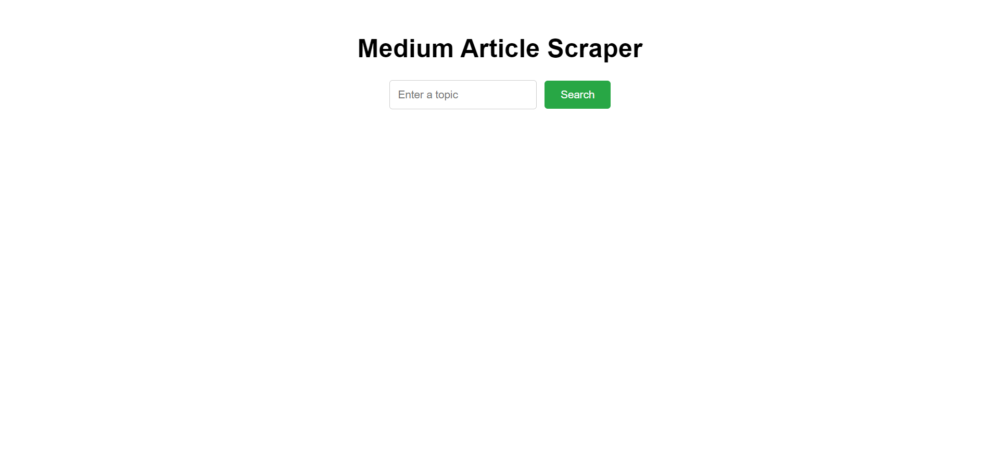
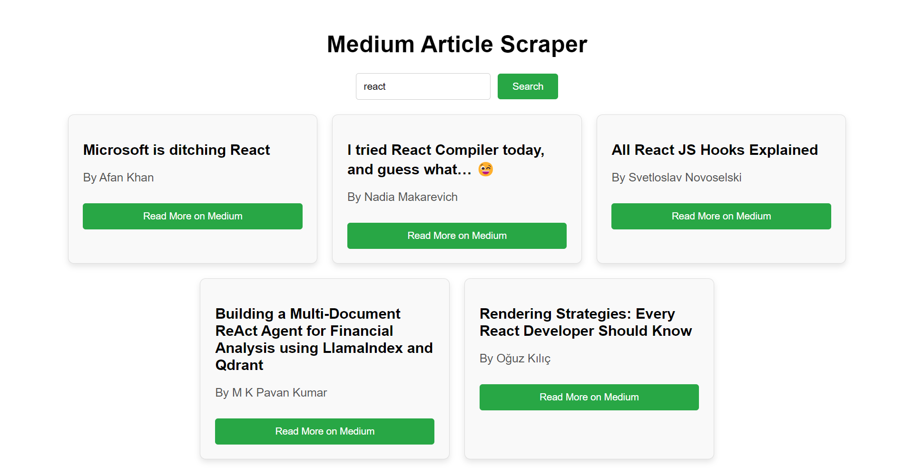

# Project Title
Medium Article Scraper and Viewer

## Introduction
This is a web application that allows users to input a topic and the app will scrape  articles related to that topic from Medium. The application displays the top 5 related articles, and users can click on an article to view it on Medium.

## Project Type
Fullstack

## Deplolyed App
Frontend: https://procuzy2-article-scraper.vercel.app/   
Backend: https://procuzy2-article-scraper.onrender.com
#### **Note**: Backend deployed link will take 1 to 3 minutes to become active for the first time only. Once it becomes active it will scrape and load data in 30 seconds.

## Directory Structure
procuzy2-article-scraper/  
├── backend/  
│   ├── node_modules/  
│   ├── .env  
│   ├── index.js  
│   ├── scraper.js   
│   ├── package.json  
│   └── package-lock.json  
|  
├── frontend/  
│   ├── node_modules/  
│   ├── public  
│   ├── src/  
│   │   ├── assets  
│   │   ├── App.css  
│   │   ├── App.jsx  
│   │   ├── index.css  
│   │   └── main.jsx  
│   ├── index.html   
│   ├── package.json  
│   ├── package-lock.json  
│   ├── vite.config.js  
│   └── README.md  
├── README.md  


## Video Walkthrough of the project

GoogleDrive link of video: https://drive.google.com/file/d/1OGd01NplEfxUHSUmsYfPPF88fcE5kr9w/view?usp=sharing  


## Features

- Scrapes Medium for articles based on user-specified topic.
- Extracts and displays article details: title, author, publication date, and URL.
- Responsive design for both desktop and mobile devices.
- Client-side form validation to ensure the topic input is not empty.
- Loading indicators while articles are being scraped.
- Error messages for scraping failures or when no articles are found.


## Installation & Getting started
Detailed instructions on how to install, configure, and get the project running.

### 1. Clone the repository
```bash
git clone https://github.com/aravindha2k/Procuzy2-Article_Scraper.git
cd <repo-name>
```

### 2. Navigate to Backend
```bash
cd .\Backend\
npm i 
npm run server
```

### 3. Navigate to Frontend 
```bash
cd .\Frontend\
npm i
npm run dev
```

## Usage

#### 1. input Topic in the input box
#### 2. click on search button 
#### 3. Top 5 articles will be shown in UI
#### 4. click the button provided in article card will take the user to medium website to read whole article

## Screenshots
### Home Page


### Search Results



## API Endpoints

### 1. POST /scrape
- **Description**: Accepts a topic and initiates scraping. Returns the top 5 articles.
- **Request**: { "topic": "your_topic_here" }

### 2. GET /articles
- **Description**: return top 5 articles


## Technology Stack
Backend: Node.js, Express, Puppeteer  
Frontend: React, Axios